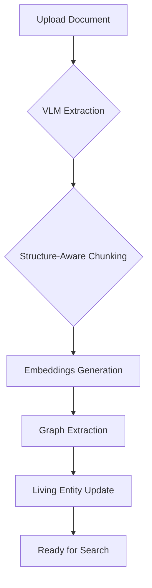

# Mosaic Architecture: Ingestion Pipeline & Schema

This document details the technical implementation of the Mosaic ingestion pipeline and the database schema that supports the multifloor model.

## Ingestion Pipeline

The pipeline is a series of steps that process raw documents into a structured, searchable knowledge base.

1.  **VLM Extraction:** Docling extracts raw text and structural elements.
2.  **Structure-Aware Chunking:** Text is divided into semantically coherent chunks based on document structure.
3.  **Embeddings Generation:** Chunks are converted into vector embeddings for semantic search.
4.  **Graph Extraction:** Entities and relationships are extracted from chunks to build the knowledge graph (Floor B).
5.  **Living Entity Update:** A CrewAI agent system analyzes the new information and updates the curated "Living Entity" pages (Floor D).

## Core Database Schema

### `living_entities`
This table stores the curated, high-level knowledge pages.

-   `entity_type`: 'material', 'mine', 'supplier', etc.
-   `name`: The canonical name of the entity.
-   `slug`: A unique, URL-friendly identifier.
-   `sections`: A JSONB field containing the structured, template-based content of the page.

### `living_entity_relationships`
Stores the connections *between* living entities.

-   `source_entity_id` / `target_entity_id`: Foreign keys to the `living_entities` table.
-   `relationship_type`: 'produces', 'supplies', 'regulates', etc.

### `living_entity_updates`
Provides a complete audit trail for all changes made to a living entity, including which agent or user made the change and what the source of the new information was.

### `living_entity_graph_links`
This is the **bridge table** that connects the curated Living Entities (Floor D) to the raw, extracted graph entities (Floor B), enabling traversal between the layers.
