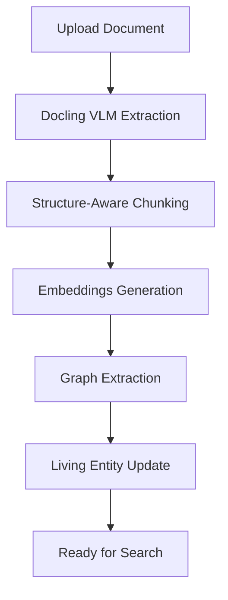

# Mosaic Architecture: Single Source of Truth

**Status:** Current Architecture | **Updated:** October 30, 2025

This document synthesizes all architectural decisions and principles into a single authoritative reference.

---

## Core Philosophy

Mosaic is built on a **multifloor traversal framework** that enables both AI agents and human users to navigate knowledge through multiple layers of abstraction, from raw text to curated living entities.

---

## The Multifloor Model

### Floor Definitions
- **Floor A – Text Semantics:** Sentence, paragraph, and document embeddings for semantic search
- **Floor B – Symbolic/Relational:** The Knowledge Graph with entities and typed relationships
- **Floor C – Structure & Provenance:** Files, chunks, timestamps, and source metadata
- **Floor D – Living Entities:** Curated, structured knowledge pages (highest abstraction level)

### Traversal Principles
- Move **up** for abstraction and synthesis
- Move **down** for grounding and evidence
- Both AI and humans traverse the same graph for explainability

---

## Ingestion Pipeline



### Pipeline Stages

1. **VLM Extraction (Docling)**
   - Extracts raw text and structural elements
   - Identifies sections, paragraphs, tables, figures
   - Preserves document hierarchy

2. **Structure-Aware Chunking (Default)**
   - Uses document sections as natural boundaries
   - Splits large sections by paragraph
   - Merges small sections with neighbors
   - Zero LLM cost, fast processing

3. **Agentic Chunking (Optional)**
   - LLM-powered semantic boundary detection
   - For complex documents with inconsistent formatting
   - Configurable per document via `chunking_config`
   - Cost: ~$0.03-$0.10 per document

4. **Embeddings Generation**
   - Vector embeddings for semantic search
   - Stored in pgvector with cosine similarity

5. **Graph Extraction**
   - LLM-driven entity and relationship extraction
   - 11 entity types, 12 relationship types
   - Automatic deduplication with three-layer approach

6. **Living Entity Update**
   - CrewAI agent system updates curated pages
   - Bridges raw graph (Floor B) to living entities (Floor D)

---

## Database Schema

### Core Tables

#### `living_entities`
```sql
- entity_type: 'material', 'mine', 'supplier', etc.
- name: Canonical entity name
- slug: URL-friendly identifier
- sections: JSONB structured content
```

#### `living_entity_relationships`
```sql
- source_entity_id / target_entity_id: Foreign keys
- relationship_type: 'produces', 'supplies', 'regulates'
```

#### `living_entity_updates`
```sql
- Complete audit trail of all changes
- Tracks agent/user and source of information
```

#### `living_entity_graph_links`
```sql
- Bridge table: Living Entities ↔ Raw Graph Entities
- Enables traversal between Floor D and Floor B
```

### Graph Tables (Floor B)
- `entities`: Extracted entities with embeddings
- `relationships`: Typed relationships between entities
- `entity_chunks`: Links entities to source chunks

### Document Tables (Floor C)
- `documents`: File metadata and processing status
- `chunks`: Text chunks with embeddings and metadata
- `embeddings`: Vector storage for chunks

---

## Performance Optimizations

### Graph Extraction
- **In-Memory Entity Cache:** Reduces DB calls by 50-80%
- **Rate Limiting:** 100ms minimum between DB calls
- **Reduced Workers:** 5 concurrent workers (from 20)
- **Result:** 10+ minutes → 2-3 minutes per document

### Search Pipeline
- **Hybrid Search:** Semantic + BM25 with RRF fusion
- **Query Enhancement:** HyDE and Multi-Query generation
- **Reranking:** Cohere API for precision
- **Graph Enhancement:** Relationship traversal for context

---

## Key Architectural Decisions

### 1. Postgres-Native Stack
- All data in Supabase (pgvector, JSONB, functions)
- No external graph databases required
- Simplifies deployment and maintenance

### 2. Human-AI Parity
- Both traverse the same graph structure
- Ensures explainability and transparency
- Consistent mental model between users and AI

### 3. Temporal Modeling
- "As-of" queries for point-in-time reconstruction
- Diff trails to track changes between versions
- Full audit trail for all entity updates

### 4. Modular Chunking
- Default: Fast, structure-aware (free)
- Optional: LLM-powered agentic chunking
- Document augmentation with question generation

### 5. Unified Search Pipeline
- Chat uses the same sophisticated search as document search
- Respects system settings from database
- Configurable depth and complexity

---

## Related Documents

- **Features:**
  - [Agentic Chunking](../features/agentic_chunking.md) - Detailed chunking strategies
  - [Graph RAG](../features/graph_rag.md) - Knowledge extraction and search
  - [Graph Learning](../features/graph-learning.md) - Search pattern analysis
  - [Reranking](../features/reranking.md) - Search precision improvement
  - [Structured Data](../features/structured-data-approch.md) - Table handling strategy

- **Guides:**
  - [Getting Started](../guides/getting_started.md) - Development setup

- **Reference:**
  - [Chunk Metadata](../reference/chunk_metadata.md) - Chunk structure reference
  - [RAG Best Practices](../reference/RAG_BEST_PRACTICES.md) - Implementation status
  - [AI SDK Patterns](../reference/ai-sdk-patterns.md) - Vercel AI SDK integration

---

*This SSoT synthesizes architectural principles from multiple documents. For implementation details, refer to the linked documents.*
