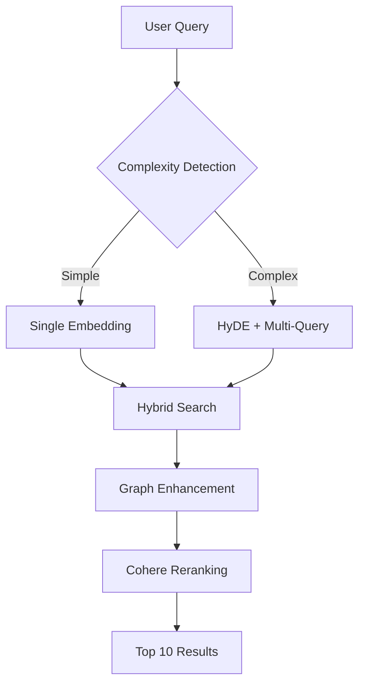

# Mosaic Features: Single Source of Truth

**Status:** Implemented Features | **Updated:** October 30, 2025

This document synthesizes all implemented and planned features into a single authoritative reference.

---

## Core Search Features

### 1. Hybrid Search Pipeline
**Status:** Implemented

The search system combines multiple techniques for optimal retrieval:

**Components:**
- **Semantic Search:** Vector similarity via pgvector
- **BM25 Search:** Keyword matching with PostgreSQL
- **RRF Fusion:** Combines semantic and keyword results
- **HyDE:** Generates hypothetical documents for complex queries
- **Multi-Query:** Creates query variations for better recall
- **Graph Search:** Traverses entity relationships
- **Reranking:** Cohere API for final precision

### 2. Graph-Enhanced Search
**Status:** Implemented

Leverages the knowledge graph to improve search:
- Expands context through relationship traversal
- Answers relational queries directly
- Disambiguates terms using entity connections
- Improves precision for entity-focused queries

### 3. Reranking
**Status:** Implemented

Final precision layer using Cohere Rerank API:
- Reorders top 10 results by relevance
- Improves search precision by 15-20%
- Configurable via system settings

---

## Document Processing Features

### 1. Structure-Aware Chunking (Default)
**Status:** Implemented

Fast, free chunking that respects document structure:
- Uses Docling-extracted sections as boundaries
- Splits large sections by paragraph
- Merges small sections with neighbors
- Zero LLM cost

### 2. Agentic Chunking (Optional)
**Status:** Implemented

LLM-powered semantic chunking for complex documents:
- Identifies semantic boundaries in inconsistent content
- Ideal for card decks, manuals with variable formatting
- Configurable per document via `chunking_config`
- Cost: ~$0.03-$0.10 per document

### 3. Document Augmentation (Question Generation)
**Status:** Implemented

Improves retrieval without hallucination:
- Generates 5 questions per chunk during ingestion
- Stores questions as separate searchable chunks
- Returns parent chunk when question matches
- Replaces HyDE hallucination risk with real questions

### 4. Planner-Executor Chunking
**Status:** Implemented

Optimal for large, complex documents:
- Planner (Gemini 2.0 Flash) reads entire document
- Outputs deterministic ChunkPlan with byte offsets
- Executor (gpt-4o-mini) enriches chunks in parallel
- Cost: ~$0.07 vs $0.30+ for segment-based

### 5. The Sorting Hat (Intelligent Router)
**Status:** Implemented

Automatically selects optimal chunking strategy:
- Analyzes document type, structure, size
- Recommends strategy with confidence score
- Routes to appropriate chunker automatically
- Zero configuration required

---

## Knowledge Graph Features

### 1. Automatic Graph Extraction
**Status:** Implemented & Optimized

Builds knowledge graph from every document:
- Postgres-native (no external graph DB)
- LLM-driven extraction with structured outputs
- 11 entity types, 12 relationship types
- Three-layer deduplication

### 2. Performance Optimizations
**Status:** Implemented

Fixed major performance bottlenecks:
- In-memory entity cache (50-80% fewer DB calls)
- Rate limiting (100ms between DB calls)
- Reduced workers (5 instead of 20)
- Result: 10+ minutes → 2-3 minutes per document

### 3. Relationship Extraction Fix
**Status:** Implemented

Fixed zero relationships issue:
- Added database lookup fallback for existing entities
- Rate limited to prevent DB overload
- Result: Fully connected knowledge graph

---

## Chat & RAG Features

### 1. RAG Chat Interface
**Status:** Implemented (Phase 6.5.1)

Full conversational interface with documents:
- Streaming responses via SSE
- Source citations with document links
- Uses complete search pipeline
- Conversation history limiting (10 turns)

### 2. Prompt Management System
**Status:** Implemented

Centralized, UI-editable prompts:
- 8 prompts stored in database
- Visual editor in Settings > Prompts
- No code changes needed for updates
- Graceful fallback to defaults

### 3. Model Configuration
**Status:** Implemented

Settings-driven model selection:
- 8 LLM settings for different use cases
- Dynamic model loading from database
- AI Gateway integration for failover
- A/B tested optimal models

---

## Structured Data Features

### 1. Table Handling Strategy
**Status:** Implemented

Three-pronged approach for tables:
- **Long Table Format:** Preserves structure in chunks
- **Document Narrative:** Explains table context
- **Bidirectional Linking:** Tables ↔ Text chunks

### 2. Chunk Metadata
**Status:** Implemented

Rich metadata for each chunk:
- Page numbers for citations
- Table HTML when present
- PDF coordinates for deep linking
- Source file attribution
- Element type tracking

---

## Graph Learning Features

### 1. Search Signal Capture
**Status:** Implemented (Phases 1-3)

Logs and analyzes search patterns:
- Query embeddings and matched chunks
- User clicks and time spent
- Co-occurrence analysis
- Suggests new relationships

### 2. Relationship Learning
**Status:** Planned

Future enhancement to:
- Discover missing entity relationships
- Learn from user query patterns
- Suggest graph improvements
- Update knowledge graph automatically

---

## Advanced Features (Planned)

### 1. DEG-RAG (Graph Denoising)
**Status:** Reference Available

Techniques for graph quality:
- Entity resolution across documents
- Triple reflection for relationship pruning
- Evidence-based verification
- Directionality corrections

### 2. Multi-Floor Architecture
**Status:** Conceptual

Future implementation for:
- Temporal graph traversal
- "As-of" queries for point-in-time views
- Diff trails for change tracking
- Living entity curation

### 3. CrewAI Integration
**Status:** Planned

Multi-agent system for:
- Living entity updates
- Complex query decomposition
- Multi-hop reasoning
- Automated graph maintenance

---

## Configuration & Settings

### 1. System Settings
All features controlled via database settings:
- Processing options (chunking, graph extraction)
- Model selection (8 LLM configurations)
- Search parameters (HyDE, reranking, graph)
- UI preferences

### 2. Document-Level Configuration
Per-document customization via `chunking_config`:
- Chunking strategy selection
- Document type hints
- Custom processing instructions
- Metadata preservation

---

## Performance Metrics

### Current Performance
- **Document Processing:** 2-3 minutes (optimized from 10+)
- **Search Response:** < 5 seconds
- **Chat Response:** < 5 seconds with streaming
- **Graph Extraction:** 50-80% fewer DB calls

### Cost Optimization
- **Chunking:** Free (structure-aware) to $0.10 (agentic)
- **Graph Extraction:** ~$0.05 per document
- **Search:** ~$0.001 per query
- **Chat:** ~$0.001 per query

---

## Related Documents

- **Architecture:**
  - [Architecture SSoT](../architecture/SSOT.md) - Core principles and pipeline

- **Guides:**
  - [Getting Started](../guides/getting_started.md) - Development setup

- **Reference:**
  - [RAG Best Practices](../reference/RAG_BEST_PRACTICES.md) - Implementation roadmap
  - [AI SDK Patterns](../reference/ai-sdk-patterns.md) - Vercel AI SDK guide
  - [DEG-RAG](../reference/DEG-RAG.md) - Graph denoising techniques
  - [LLM Pricing](../reference/LLM_PRICING.md) - Cost optimization

- **Completed:**
  - [Completed Features](../completed/) - Implementation details and test plans

---

*This SSoT synthesizes feature documentation. For implementation details, refer to specific feature documents or the completed implementation notes.*
